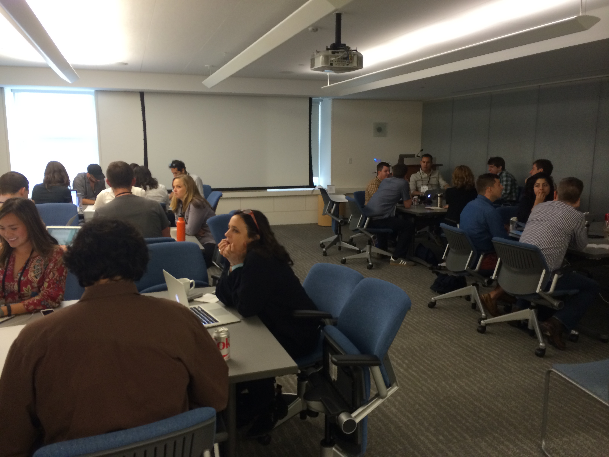
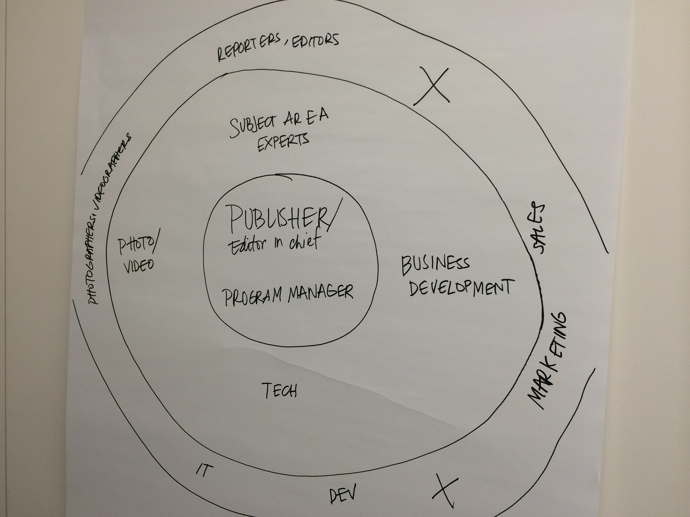
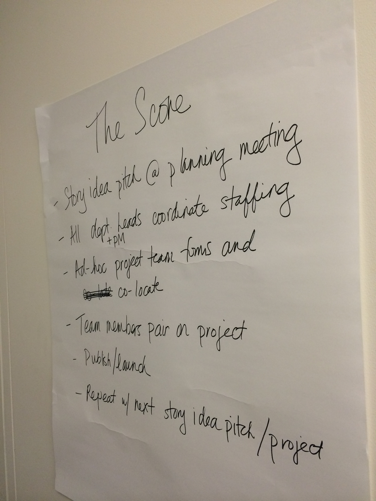
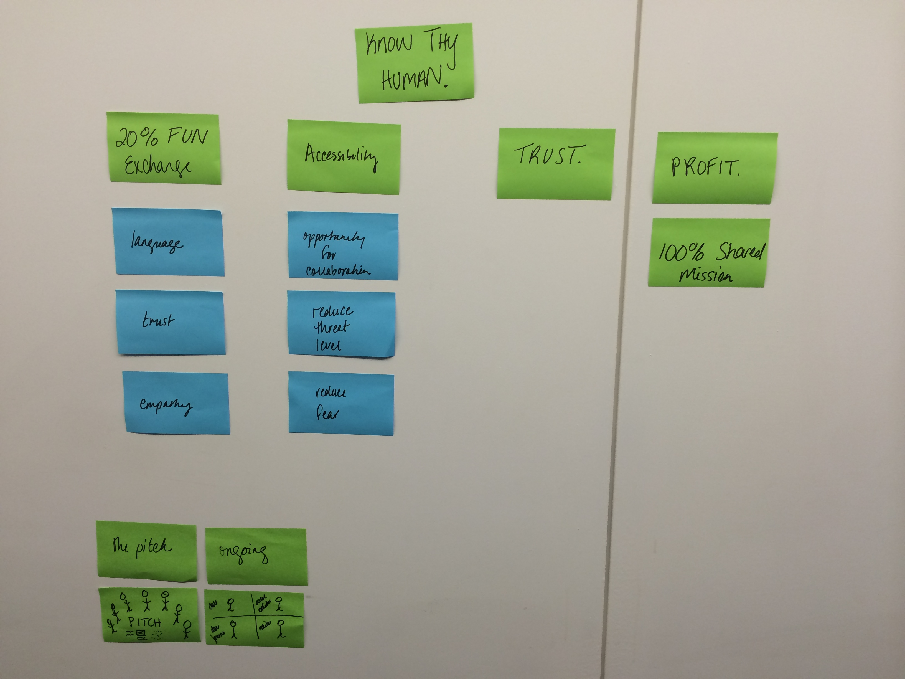
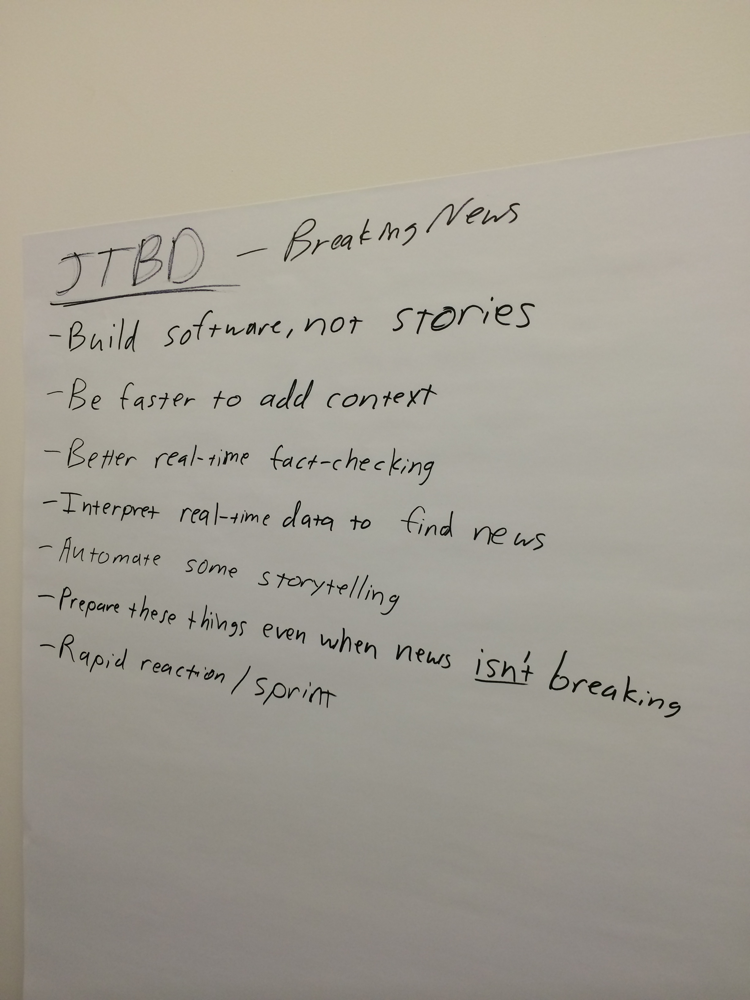
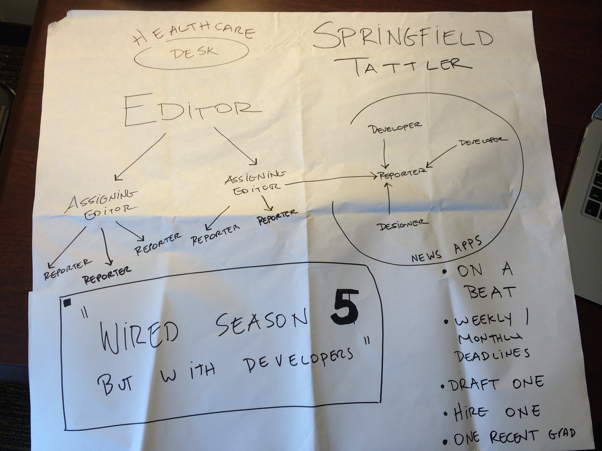

##Before we can fix the news, we need to redesign the newsroom

*Rough notes from the workshop on Thursday, July 24, 2014 [at SRCCON](http://schedule.srccon.org/#_session-11) in Philadelphia.*

In this session, I’d like us to talk about how we can redesign the newsroom itself to upend our clunky workflows pegged to Sunday’s paper instead of online today.

Let's get a bunch of smart people in a room to produce action-oriented recommendations for news organizations to integrate developers into their newsrooms as journalists.

Until this spring, I worked for a major U.S. newspaper chain that operated 75 papers in 17 states. The company had zero developers in its newsrooms working on editorial projects. At my paper before that, we had zero developers in our newsroom, and no one in the company overtly doing news development. The status quo in both of those companies was that my teams had to wage guerilla war on the IT departments and the product and CMS divisions to do the kind of journalism we know is important. Building and maintaining the CMS is critical, and product development is important, but in my mind, every newsroom needs to have people who can crunch data and build interactive graphics and news apps. How do we make that happen, when the vast majority of American newsrooms are like those in my former companies?

In May, I attended a workshop hosted by ASNE called "Hacking News Leadership," which introduced top editors from major metro dailies to data journalists and news developers. We spent a couple of days talking about some of these issues and the resulting [recommendations are worth a quick read](http://bit.ly/1A7p0r8). It was a good first step the editors there to hear about this journalism. But there was one thing [Trei Brundrett](https://twitter.com/ultracasual/status/462658533524123649) said that got me thinking:

> The most interesting design challenge of 2014 is of our organizations and how they work.

Too many news organizations, large and small, still don't have news developers. If they do, they're strapped on to the side of a workflow that revolves around making a great Sunday paper. We can do better than that. This exercise is about more than just rearranging deck chairs. Together, we can wipe the slate clean and design a newsroom that builds skills throughout the organization, forcing people to think smarter about the internet as a primary medium rather than an afterthought.

###The session will break down like this:
*25 mins - intro/venting/clearing the air*

Go round the room and quickly have everyone introduce themselves.

- Where are you from/what kind of newsroom do you work in?
- What's driving you crazy in your newsroom? What do you like?
- What do you want to get out of this? What would be useful for you on Monday?

###Group therapy

The frustrations that came out of these introductions were probably all too familiar to anyone who's worked in a newsroom:
- There's a huge need for interactive news development, but very little value is placed on it by newsroom leaders.
- An organization's operating structures get in the way.
- Data/news apps teams are seen as toys rather than integral.
- The desk structure of a print paper carries over to the online product.
- Each team is disconnected from the others.
- Everyone is reproducing the same problems we've always had.
- If it's a team of one, that person can sometimes be allowed to do what they want, if they stay under the radar.
- The word "dysfunction" was used over and over again.
- We're frustrated that "getting better at the CMS" and "tweet more" is the goal now for news orgs.
- The system is broken.

Interestingly, a show of hands indicated that ~8-10 people in the room work in newspapers/daily news operations today. When asked how many worked in such a shop 5 years ago, the number of hands held up nearly doubled.

*90 mins (1:55 hr) - group work*

Try to be in a group with people you don't know. Let's get a good mix of developer and non, green and experienced, newspaper and online, print and broadcast, whatever.

Our goal is broadly defined, and I want each group to decide what you're going to produce, but here are some rough guidelines. We're not looking for another Google doc of bullet points. This can be code. This can be user stories. This can be prototypes. This can be an interpretive dance cycle. Whatever you think will have legs beyond this room. If you want to use a very strict, d-school, HCD process, go for it. If you want everything to be about agile, fine. **We're looking for both strategy and tactics here.**

Answer this question:

>How might we help integrate journalist-developers into our newsrooms and build more folks with those skills to produce high quality journalism online?

Your group will be assigned one of these scenarios to tackle:
- A general interest, mid-sized metropolitan newspaper company with online operations of some sort.
- A small newspaper with limited web presence and no history of news development
- A for-profit online-only startup newsroom covering a single subject or area.
- A breaking news centered operation
- A non-profit, investigative news operation.

At least one person in your group should be a notetaker. Each group should decide who will present its conclusions, either one person or the group as a whole.

If you haven't, look at the recommendations that came out of the [Hacking News Leadership](http://bit.ly/1kVq3ke) conference.

Some questions to consider:
* If you were the editor of your average major metro daily, how would you redraw your organization to make this work?
* How can we redesign our newsrooms to bring news developers into the reporting process at the beginning and to help everyone else master new skills?
* Should we adopt [Ben Welsh’s philosophy](https://docs.google.com/a/tommeagher.com/presentation/d/1QdiQvVzUf1N7BkDZyo-XFgIQ8xqYWUR0de-BGaCijVQ/edit#slide=id.g17886bedb_010) that we ought to train web producers to become news devs and not just SEO-experts and explainer explainers?
* Should we follow Scott Klein’s model of making every developer a reporter, designer and data expert?
* How many AMEs do you really need?
* Should web producers sit together or with the copy desk and paginators? Should they be in the same room/floor/building/state as reporters and editors?
* What are the jobs that really need to be done here?
* What's the budget impact of our changes?
* How does it work day to day?
* What product are the developers working on?
* Organization, distribution of responsibilities, hiring and skill development...

And some caveats:
- We're talking about using code to build stories, experiences and tools, not getting more people comfortable with using existing tools, like cell phones, Twitter, etc.
- We're not talking about the exceptional newsrooms here. The New York Times and ProPublica and the Washington Post are fine. They don't need our help. We're talking about the El Paso Times, the Redlands Daily Facts or the Columbia Daily Tribune.
- Newsroom managers tend to think of every staffing decision as a zero-sum game. "If we need a body to cover the courts, who will lay out the Family Circus page? WE HAVE TO HAVE A FAMILY CIRCUS PAGE OR THERE WILL BE RIOTING IN THE STREETS!" As much as you can, be prepared for these kind of counter arguments.
- Assume the worst. No newsroom is going to magically find $500,000 in the budget to hire a team of 5. What is a realistic path here?
- This is not nearly enough time to do this exercise, but it's better to start than to do nothing at all.

*10 min (2:05) break*

*25 mins (2:30) - presentations. Say 5 minutes per group.*

Here's what we came up with...

##Five pitches that will save journalism

###"The Score"

A for-profit online-only startup newsroom covering a single subject or area.

This small organization created a tightly integrated, multidisciplinary newsroom, with writers, visual journalists, project managers, developers and beat reporters working side by side. Business development and marketing would play a central role in the newsroom as well.

At daily meetings, all department heads and project managers would pitch stories and coordinate staffing. For each project, ad-hoc teams with specialists in each medium would be spun up, and they would co-locate for the duration of the project. They'd hope this could make journalists more tech savvy while forcing coders to be more editorially minded. For the developers, the bar would be set very high for documentation and reusability. The idea is for all of the parts of the newsroom to function as an orchestra, making beautiful music together with the project manager as the conductor (thus "The Score").

One concern raised was that ad hoc teams can be hard, particularly early in the life of an organization. With the potential for high turnover, it can take time to learn how to collaborate and work together. The hope from the team, however, was that by quickly forming teams for each project, you could learn much easier which people work well together. When there's a good match between a reporter and a designer or a developer and an editor, for instance, the newsroom would try to keep pairing them for future projects. When a team doesn't work as well together, it's evaluated and recalibrated for the next story.

###The small local paper

"Our scenario was kind of fraught," said Davis Shaver, at the start of this team's report back. Charged with figuring out how to bring editorial development skills to a small paper focused on local news, with little to no potential funding for new staffing, this may have been the hardest scenario of the workshop.

This team team batted around several ideas for creative ways to build revenue and cut costs to pay for development skills. They floated the idea of putting the newsroom in the back of a coffee shop, as one paper in Connecticut has done. They talked about building an online agency that would spend 75 percent of its time working on commercial projects for local businesses and the remainder on editorial projects.

Another huge concern was building skills and retaining talent in a newsroom with potentially high turnover. Good people leave quickly, and those who stay for eons may not be the best journalists you want to keep. They suggested partnering with outside professional organizations, like API or ONA, to set up a pipeline of inexpensive training to help retain talent. They mused about converting an editor or copy desk job into a coach role, someone whose entire job is to improve coverage and provide continuity of skills through the turnover. They hoped this would help stave off attrition, in a sector of the industry where many talented people are jumping off of every ship they can find.

Perhaps this paper drops days of print and uses the time and savings to focus on online community building instead of meeting coverage. One cool idea from the rest of the room was to develop an in-house Mechanical Turk, hiring clerks to handle transcription and data entry projects for other local businesses.

This team faced maybe the biggest conceptual (and financial) hurdle of the exercise, and its members seemed to feel their paper's pain the most viscerally. Half of the team left before the end of the session, and those who remained looked exhausted and downtrodden during their pitch.

###The non-profit, investigative site

This group started with some constraints and some characteristics.

"We aimed for a news org employing ten people, of whom six were editorial. We ended up with eleven. The site was based in San Diego.
We didn't articulate the mission in the session, but I think we were working with the assumption that it was an accountability-type newsroom with beats and topics flowing from the needs of the San Diego community."

"After identifying all the skills and work that would need to be done, we grouped them into newsroom roles. Our approach here was to produce realistic job descriptions, avoiding unicorns by hiring for deep skills according to the job title, but looking for people with the possiblity of aptitudes beyond the title: techs who can write, reporters who can photograph and count."

In newsroom

1. Photo/vid/visual journalist
2. Front-end interaction designer/developer
3. Data reporter, investigative
4. Metrics/Project Manager/Audit person — makes things happen, then asks whether they are working
5. Developer with some crossover skills
6. Writer/reporter

Business Roles

1. Editor/CEO 
This, of course, is a crucial role. Her primary responsibilities are fostering team cohesion, keeping the team focussed and motivated. That means she would need to have a strong commitment to organizational design and prioritizing integration in the newsroom. Unlike many CEO roles, this is a very 'inward' facing role, instead of being the most active public face. 
Working collaboratively with the team, she articulates the editorial agenda and makes the call on priorities and what a story or product is ready to ship.
2. Office manager
3. HR person
This is not your grandma's HR. We're putting the 'human' back in human resources. Spiritually-oriented folk might think of this role as the Gaia. He or she is responsible for organizational goodness, working closely with the CEO to make sure the whole team has what they need to produce great work; workloads are healthy and the right kit is available.
4. Biz dev/UX/sociologist/anthropologist
This is the main outward-facing business role. It's the ultimate in marketing; understanding the local community, its journalism needs, what service the organization can provide, the intersection of those and what funders can be convinced to pay for. Then getting those dollar bills to flow, baby.
5. Ad sales

We designed the organization and operating model to avoid the following risks:
- unclear roles.
- too many roles.
- overwork.
- Lack of recognition or understanding
- Competing for resources
- too many ideas, not enough action.

We had several suggestions for tactics and advantages that could make a difference:
- Clearly defined and communicated goals
- Training each other — have everyone involved, participate in training
- Have everyone sit together in the room
- Collab planning, regular meetings to talk through obstacles
- Clear paths
- Prioritization and smallify the work (versus overloading people)
- Celebrating the wins and achievements of your team
- Flexibility, dogs at work
- Ongoing skills development
- Evaluate and reflect — needs to come from top of the org
- Treat the week as the work unit
- Organizational flexibility

###Breaking all the news!
The team tasked with rethinking a news operation whose primary focus is covering breaking news had an intriguing suggestion for building competency (and empathy) across departments. Each person would spend 20 percent of his or her time rotating through other desks and departments.

One participant from another group mentioned the research center in Antarctica, which has a two-person newspaper. There's one person there whose entire job is making sure everyone else doesn't go crazy. You can build camaraderie and hopefully retain talent by having a person charged with finding ways and events to ensure people like their jobs.

###The Wire Season Five with Developers

The final presentation came from the team re-thinking the mid-sized metro daily paper.

They tailored their recommendations for The Springfield Tattler, which covers news in Springfield, *inaudible*.

Rather than creating a "news apps" desk or "interactive team" that served the newsroom at large, and operated as its own unit, this team wanted to infest one desk with developers. In Springfield, hospitals and healthcare are a major employer and issue. The Tattler has a number of reporters who own that beat. This team recommended sending a three-person team to operate on this desk:

- Steal one developer from the existing IT department through a draft.
- Hire a 'real developer, like from the internet,' by offering a living wage and 20 percent time to work on open source projects.
- Hire a talented but green recent college grad "who has no idea about the value of money" to learn from the developers, editors and reporters on the team.

The thinking behind this team is to avoid a separate staff from the general newsroom and from the IT department. After some successes, the model could move to other beats or grow the team. "Everyone loves a beat. If we're going to truly infiltrate them, we need to learn to walk among them and speak their language."

As this team racks up successes, there'd be a real danger of being co-opted by the IT team. To avoid this, the newsroom developers would have to make friendly with IT and could play "Trading Places", rotating IT folks into the team for weeks or months at a time. This could give the IT staff a stake in making sure the team succeeds. The news devs and IT folks could also be on a single Slack instance to trade GIFs.

There would also likely be a motion to have the news developers report to the head of IT or product because presumably journalists don't know how to manage coders. This team recommended ignoring that impulse and keeping the devs integrated in the newsroom management structure.

*What did I miss? What did I leave out? [Tweet at me](http://www.twitter.com/ultracasual) or [file an issue](https://github.com/tommeagher/redesign/issues), and I'll fix it. You can also feel free to fork and send a pull request, if that's your thing.*
